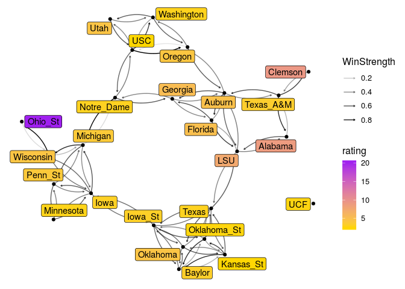

```r
n<-network.initialize(nrow(rankedteams), directed = TRUE, multiple = FALSE, loops = TRUE)
rankedteams <- rankedteams %>% mutate(ranking = min_rank(desc(Rating)))
network.vertex.names(n) <- as.character(teams$Team)
n %v% "rank" <- left_join(teams, rankedteams, c("Team"))$ranking
n %v% "rating" <- left_join(teams, rankedteams, c("Team"))$Rating
#n %v% "conference" <- as.character(rankedteams$Conference)

network.adjacency( A_unnormed, n, ignore.eval = FALSE, names.eval = c("WinStrength"))
```

# D1 Top 25 


```r
rankedteams %>% filter(Ranking < 26) %>% select(-ranking) %>%knitr::kable()
```


 Ranking      Rating  Team        
--------  ----------  ------------
       1   22.217900  Ohio_St     
       2   10.342287  Alabama     
       3    7.341821  Clemson     
       4    6.107164  LSU         
       5    5.174158  Auburn      
       6    4.894093  Wisconsin   
       7    4.858868  Oklahoma    
       8    4.629178  Penn_St     
       9    4.476366  Oregon      
      10    4.419254  Florida     
      11    4.367871  Utah        
      12    4.271719  Georgia     
      13    3.472604  UCF         
      14    3.377414  Texas_A&M   
      15    3.350357  Michigan    
      16    3.049749  Washington  
      17    2.991697  Baylor      
      18    2.723413  Memphis     
      19    2.715720  Texas       
      20    2.711252  Oklahoma_St 
      21    2.711088  Iowa_St     
      22    2.689442  Kansas_St   
      23    2.655853  Navy        
      24    2.627739  Iowa        
      25    2.448173  Michigan_St 


```r
filter(rankedteams, Team %in% FBSteams$X2) %>% filter( min_rank( desc(Rating)) <26) %>% select(-ranking) %>% knitr::kable()
```


 Ranking      Rating  Team        
--------  ----------  ------------
       1   22.217900  Ohio_St     
       2   10.342287  Alabama     
       3    7.341821  Clemson     
       4    6.107164  LSU         
       5    5.174158  Auburn      
       6    4.894093  Wisconsin   
       7    4.858868  Oklahoma    
       8    4.629178  Penn_St     
       9    4.476366  Oregon      
      10    4.419254  Florida     
      11    4.367871  Utah        
      12    4.271719  Georgia     
      13    3.472604  UCF         
      14    3.377414  Texas_A&M   
      15    3.350357  Michigan    
      16    3.049749  Washington  
      17    2.991697  Baylor      
      18    2.723413  Memphis     
      19    2.715720  Texas       
      20    2.711252  Oklahoma_St 
      21    2.711088  Iowa_St     
      22    2.689442  Kansas_St   
      23    2.655853  Navy        
      24    2.627739  Iowa        
      25    2.448173  Michigan_St 


```r
#net<-ggnetwork(n %s% which( n %v% "rank" < 26), layout="fruchtermanreingold")
net<-ggnetwork(n , layout="fruchtermanreingold")
ggplot(net, aes(x = x, y = y, xend = xend, yend = yend))+
  geom_edges(alpha=0.1)+
  geom_nodes( aes(color=rating), alpha=0.5 ) +theme_blank()+
  scale_color_gradient(low="purple", high="gold")#+
```

<!-- -->

```r
#  geom_nodelabel_repel(aes(label=vertex.names))
```


```r
net<-ggnetwork(n %s% which( (n %v% "vertex.names") %in% FBSteams$X2), layout="fruchtermanreingold")
#net<-ggnetwork(n , layout="fruchtermanreingold")
ggplot(net, aes(x = x, y = y, xend = xend, yend = yend))+
  geom_edges(alpha=0.1)+
  geom_nodes( aes(color=rating), alpha=0.5 ) +theme_blank()+
  scale_color_gradient(low="purple", high="gold")#+
```

<!-- -->

```r
#  geom_nodelabel_repel(aes(label=vertex.names))
```


```r
net<-ggnetwork(n %s% which( n %v% "rank" < 26), layout="fruchtermanreingold")
#net<-ggnetwork(n , layout="fruchtermanreingold")
ggplot(net, aes(x = x, y = y, xend = xend, yend = yend))+
  geom_edges(aes(alpha=WinStrength), curvature = 0.2, arrow = arrow(length=unit(2, "points")))+
  geom_nodes(  ) +theme_blank()+
  geom_nodelabel_repel(aes(label=vertex.names, fill=rating))+
  scale_color_gradient(low="purple", high="gold")+
  scale_fill_gradient(low="gold", high="purple")
```

<!-- -->


```r
n<-network.initialize(nrow(rankedteams), directed = TRUE, multiple = FALSE, loops = TRUE)
rankedteams <- rankedteams %>% mutate(ranking = min_rank(desc(Rating)))
network.vertex.names(n) <- as.character(teams$Team)
n %v% "rank" <- left_join(teams, rankedteams, c("Team"))$ranking
n %v% "rating" <- left_join(teams, rankedteams, c("Team"))$Rating
#n %v% "conference" <- as.character(rankedteams$Conference)

network.adjacency( A_unnormed, n, ignore.eval = FALSE, names.eval = c("WinStrength"))
```

# D3 Top 25 


```r
rankedteams %>% filter(Ranking < 26) %>% select(-ranking) %>%knitr::kable()
```


 Ranking      Rating  Team            
--------  ----------  ----------------
       1   16.447465  Wheaton_IL      
       2   14.411175  Mt_Union        
       3    8.788439  N_Central_IL    
       4    5.547891  Bridgewater_VA  
       5    4.941008  Muhlenberg      
       6    4.828862  M_Hardin-Baylor 
       7    4.137272  Hardin-Simmons  
       8    3.997341  Ithaca          
       9    3.984881  Redlands        
      10    3.724313  Delaware_Val    
      11    3.647178  St_John's_MN    
      12    3.460950  Linfield        
      13    3.193853  Salisbury       
      14    3.135445  WI_Whitewater   
      15    2.980114  IL_Wesleyan     
      16    2.952737  Union_NY        
      17    2.929932  Susquehanna     
      18    2.740523  Cortland_St     
      19    2.657957  TX_Lutheran     
      20    2.616170  WI_LaCrosse     
      21    2.611175  WI_Platteville  
      22    2.611090  Stevenson       
      23    2.542431  Chapman         
      24    2.466704  Bethel_MN       
      25    2.453116  John_Carroll    

```r
rankedteams %>% filter(Team == " Loras") %>% select(-ranking)
```

```
##   Ranking    Rating   Team
## 1     167 0.2590828  Loras
```


```r
#net<-ggnetwork(n %s% which( n %v% "rank" < 26), layout="fruchtermanreingold")
net<-ggnetwork(n , layout="fruchtermanreingold")
ggplot(net, aes(x = x, y = y, xend = xend, yend = yend))+
  geom_edges(alpha=0.1)+
  geom_nodes( aes(color=rating), alpha=0.5 ) +theme_blank()+
  scale_color_gradient(low="purple", high="gold")#+
```

<!-- -->

```r
#  geom_nodelabel_repel(aes(label=vertex.names))
```


```r
net<-ggnetwork(n %s% which( n %v% "rank" < 26), layout="fruchtermanreingold")
#net<-ggnetwork(n , layout="fruchtermanreingold")
ggplot(net, aes(x = x, y = y, xend = xend, yend = yend))+
  geom_edges(aes(alpha=WinStrength), curvature = 0.2, arrow = arrow(length=unit(2, "points")))+
  geom_nodes(  ) +theme_blank()+
  geom_nodelabel_repel(aes(label=vertex.names, fill=rating))+
  scale_color_gradient(low="purple", high="gold")+
  scale_fill_gradient(low="gold", high="purple")
```

<!-- -->
