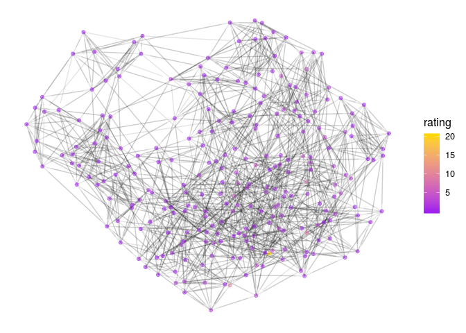

```r
n<-network.initialize(nrow(rankedteams), directed = TRUE, multiple = FALSE, loops = TRUE)
rankedteams <- rankedteams %>% mutate(ranking = min_rank(desc(Rating)))
network.vertex.names(n) <- as.character(teams$Team)
n %v% "rank" <- left_join(teams, rankedteams, c("Team"))$ranking
n %v% "rating" <- left_join(teams, rankedteams, c("Team"))$Rating
#n %v% "conference" <- as.character(rankedteams$Conference)

network.adjacency( A_unnormed, n, ignore.eval = FALSE, names.eval = c("WinStrength"))
```

# D1 Top 25 


```r
rankedteams %>% filter(Ranking < 26) %>% select(-ranking) %>%knitr::kable()
```


 Ranking      Rating  Team           
--------  ----------  ---------------
       1   20.184025  Ohio_St        
       2    9.585563  Alabama        
       3    7.561414  Oklahoma       
       4    7.359572  LSU            
       5    6.104132  Clemson        
       6    5.869664  Wisconsin      
       7    5.174654  Auburn         
       8    5.066581  Florida        
       9    4.514886  Georgia        
      10    4.336647  Oregon         
      11    4.124806  Penn_St        
      12    3.750317  Utah           
      13    3.732134  Texas          
      14    3.603655  Washington     
      15    3.232957  Notre_Dame     
      16    3.008372  Baylor         
      17    2.988885  Texas_A&M      
      18    2.956104  Iowa_St        
      19    2.921356  Memphis        
      20    2.900549  USC            
      21    2.808924  UCF            
      22    2.748234  Missouri       
      23    2.608578  Michigan_St    
      24    2.604848  South_Carolina 
      25    2.527108  Iowa           


```r
filter(rankedteams, Team %in% FBSteams$X2) %>% filter( min_rank( desc(Rating)) <26) %>% select(-ranking) %>% knitr::kable()
```


 Ranking      Rating  Team           
--------  ----------  ---------------
       1   20.184025  Ohio_St        
       2    9.585563  Alabama        
       3    7.561414  Oklahoma       
       4    7.359572  LSU            
       5    6.104132  Clemson        
       6    5.869664  Wisconsin      
       7    5.174654  Auburn         
       8    5.066581  Florida        
       9    4.514886  Georgia        
      10    4.336647  Oregon         
      11    4.124806  Penn_St        
      12    3.750317  Utah           
      13    3.732134  Texas          
      14    3.603655  Washington     
      15    3.232957  Notre_Dame     
      16    3.008372  Baylor         
      17    2.988885  Texas_A&M      
      18    2.956104  Iowa_St        
      19    2.921356  Memphis        
      20    2.900549  USC            
      21    2.808924  UCF            
      22    2.748234  Missouri       
      23    2.608578  Michigan_St    
      24    2.604848  South_Carolina 
      25    2.527108  Iowa           


```r
#net<-ggnetwork(n %s% which( n %v% "rank" < 26), layout="fruchtermanreingold")
net<-ggnetwork(n , layout="fruchtermanreingold")
ggplot(net, aes(x = x, y = y, xend = xend, yend = yend))+
  geom_edges(alpha=0.1)+
  geom_nodes( aes(color=rating), alpha=0.5 ) +theme_blank()+
  scale_color_gradient(low="purple", high="gold")#+
```

<!-- -->

```r
#  geom_nodelabel_repel(aes(label=vertex.names))
```


```r
net<-ggnetwork(n %s% which( (n %v% "vertex.names") %in% FBSteams$X2), layout="fruchtermanreingold")
#net<-ggnetwork(n , layout="fruchtermanreingold")
ggplot(net, aes(x = x, y = y, xend = xend, yend = yend))+
  geom_edges(alpha=0.1)+
  geom_nodes( aes(color=rating), alpha=0.5 ) +theme_blank()+
  scale_color_gradient(low="purple", high="gold")#+
```

<!-- -->

```r
#  geom_nodelabel_repel(aes(label=vertex.names))
```


```r
net<-ggnetwork(n %s% which( n %v% "rank" < 26), layout="fruchtermanreingold")
#net<-ggnetwork(n , layout="fruchtermanreingold")
ggplot(net, aes(x = x, y = y, xend = xend, yend = yend))+
  geom_edges(aes(alpha=WinStrength), curvature = 0.2, arrow = arrow(length=unit(2, "points")))+
  geom_nodes(  ) +theme_blank()+
  geom_nodelabel_repel(aes(label=vertex.names, fill=rating))+
  scale_color_gradient(low="purple", high="gold")+
  scale_fill_gradient(low="gold", high="purple")
```

<!-- -->


```r
n<-network.initialize(nrow(rankedteams), directed = TRUE, multiple = FALSE, loops = TRUE)
rankedteams <- rankedteams %>% mutate(ranking = min_rank(desc(Rating)))
network.vertex.names(n) <- as.character(teams$Team)
n %v% "rank" <- left_join(teams, rankedteams, c("Team"))$ranking
n %v% "rating" <- left_join(teams, rankedteams, c("Team"))$Rating
#n %v% "conference" <- as.character(rankedteams$Conference)

network.adjacency( A_unnormed, n, ignore.eval = FALSE, names.eval = c("WinStrength"))
```

# D3 Top 25 


```r
rankedteams %>% filter(Ranking < 26) %>% select(-ranking) %>%knitr::kable()
```


 Ranking      Rating  Team            
--------  ----------  ----------------
       1   10.789755  Mt_Union        
       2   10.736670  Wheaton_IL      
       3    6.433340  Bridgewater_VA  
       4    6.013819  N_Central_IL    
       5    5.947663  Ithaca          
       6    5.900085  Muhlenberg      
       7    5.287433  Redlands        
       8    4.558434  Cortland_St     
       9    4.412553  M_Hardin-Baylor 
      10    4.319533  St_John's_MN    
      11    3.862694  Linfield        
      12    3.801841  Delaware_Val    
      13    3.622842  Chapman         
      14    3.205232  IL_Wesleyan     
      15    3.066862  Susquehanna     
      16    3.000745  Hardin-Simmons  
      17    2.998336  Stevenson       
      18    2.910007  Randolph-Macon  
      19    2.750126  WI_Whitewater   
      20    2.735437  Johns_Hopkins   
      21    2.640591  Salisbury       
      22    2.616430  Averett         
      23    2.490549  Alfred          
      24    2.353887  Whitworth       
      25    2.321242  WI_Oshkosh      

```r
rankedteams %>% filter(Team == " Loras") %>% select(-ranking)
```

```
##   Ranking   Rating   Team
## 1     176 0.231704  Loras
```


```r
#net<-ggnetwork(n %s% which( n %v% "rank" < 26), layout="fruchtermanreingold")
net<-ggnetwork(n , layout="fruchtermanreingold")
ggplot(net, aes(x = x, y = y, xend = xend, yend = yend))+
  geom_edges(alpha=0.1)+
  geom_nodes( aes(color=rating), alpha=0.5 ) +theme_blank()+
  scale_color_gradient(low="purple", high="gold")#+
```

<!-- -->

```r
#  geom_nodelabel_repel(aes(label=vertex.names))
```


```r
net<-ggnetwork(n %s% which( n %v% "rank" < 26), layout="fruchtermanreingold")
#net<-ggnetwork(n , layout="fruchtermanreingold")
ggplot(net, aes(x = x, y = y, xend = xend, yend = yend))+
  geom_edges(aes(alpha=WinStrength), curvature = 0.2, arrow = arrow(length=unit(2, "points")))+
  geom_nodes(  ) +theme_blank()+
  geom_nodelabel_repel(aes(label=vertex.names, fill=rating))+
  scale_color_gradient(low="purple", high="gold")+
  scale_fill_gradient(low="gold", high="purple")
```

<!-- -->
