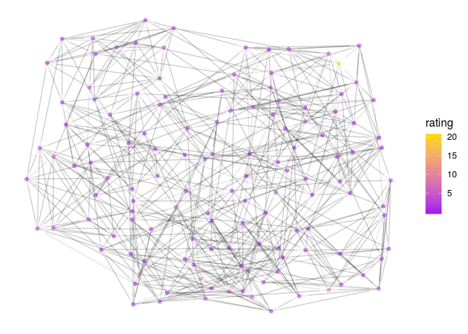

```r
n<-network.initialize(nrow(rankedteams), directed = TRUE, multiple = FALSE, loops = TRUE)
rankedteams <- rankedteams %>% mutate(ranking = min_rank(desc(Rating)))
network.vertex.names(n) <- as.character(teams$Team)
n %v% "rank" <- left_join(teams, rankedteams, c("Team"))$ranking
n %v% "rating" <- left_join(teams, rankedteams, c("Team"))$Rating
#n %v% "conference" <- as.character(rankedteams$Conference)

network.adjacency( A_unnormed, n, ignore.eval = FALSE, names.eval = c("WinStrength"))
```

#D1 Top 25 


```r
rankedteams %>% filter(Ranking < 26) %>% select(-ranking) %>%knitr::kable()
```


 Ranking      Rating  Team           
--------  ----------  ---------------
       1   21.560985  Alabama        
       2    7.472614  Georgia        
       3    6.796791  Clemson        
       4    6.031117  Michigan       
       5    5.074764  LSU            
       6    4.307225  Mississippi_St 
       7    4.195666  Oklahoma       
       8    4.167342  Texas_A&M      
       9    4.082495  Missouri       
      10    3.893361  Kentucky       
      11    3.863540  West_Virginia  
      12    3.795878  Notre_Dame     
      13    3.785985  Florida        
      14    3.283115  Auburn         
      15    3.193376  Ohio_St        
      16    2.950013  Iowa           
      17    2.913687  Utah_St        
      18    2.842618  Penn_St        
      19    2.738834  South_Carolina 
      20    2.733114  Purdue         
      21    2.678181  Iowa_St        
      22    2.632236  Texas          
      23    2.582300  UCF            
      24    2.576005  Texas_Tech     
      25    2.563487  Michigan_St    


```r
filter(rankedteams, Team %in% FBSteams$X2) %>% filter( min_rank( desc(Rating)) <26) %>% select(-ranking) %>% knitr::kable()
```


 Ranking      Rating  Team           
--------  ----------  ---------------
       1   21.560985  Alabama        
       2    7.472614  Georgia        
       3    6.796791  Clemson        
       4    6.031117  Michigan       
       5    5.074764  LSU            
       6    4.307225  Mississippi_St 
       7    4.195666  Oklahoma       
       8    4.167342  Texas_A&M      
       9    4.082495  Missouri       
      10    3.893361  Kentucky       
      11    3.863540  West_Virginia  
      12    3.795878  Notre_Dame     
      13    3.785985  Florida        
      14    3.283115  Auburn         
      15    3.193376  Ohio_St        
      16    2.950013  Iowa           
      17    2.913687  Utah_St        
      18    2.842618  Penn_St        
      19    2.738834  South_Carolina 
      20    2.733114  Purdue         
      21    2.678181  Iowa_St        
      22    2.632236  Texas          
      23    2.582300  UCF            
      24    2.576005  Texas_Tech     
      25    2.563487  Michigan_St    


```r
#net<-ggnetwork(n %s% which( n %v% "rank" < 26), layout="fruchtermanreingold")
net<-ggnetwork(n , layout="fruchtermanreingold")
ggplot(net, aes(x = x, y = y, xend = xend, yend = yend))+
  geom_edges(alpha=0.1)+
  geom_nodes( aes(color=rating), alpha=0.5 ) +theme_blank()+
  scale_color_gradient(low="purple", high="gold")#+
```

<!-- -->

```r
#  geom_nodelabel_repel(aes(label=vertex.names))
```


```r
net<-ggnetwork(n %s% which( (n %v% "vertex.names") %in% FBSteams$X2), layout="fruchtermanreingold")
#net<-ggnetwork(n , layout="fruchtermanreingold")
ggplot(net, aes(x = x, y = y, xend = xend, yend = yend))+
  geom_edges(alpha=0.1)+
  geom_nodes( aes(color=rating), alpha=0.5 ) +theme_blank()+
  scale_color_gradient(low="purple", high="gold")#+
```

<!-- -->

```r
#  geom_nodelabel_repel(aes(label=vertex.names))
```


```r
net<-ggnetwork(n %s% which( n %v% "rank" < 26), layout="fruchtermanreingold")
#net<-ggnetwork(n , layout="fruchtermanreingold")
ggplot(net, aes(x = x, y = y, xend = xend, yend = yend))+
  geom_edges(aes(alpha=WinStrength), curvature = 0.2)+
  geom_nodes(  ) +theme_blank()+
  geom_nodelabel_repel(aes(label=vertex.names, fill=rank))+
  scale_color_gradient(low="purple", high="gold")+
  scale_fill_gradient(low="gold", high="purple")
```

```
## Warning: Ignoring unknown parameters: segment.color
```

<!-- -->


```r
n<-network.initialize(nrow(rankedteams), directed = TRUE, multiple = FALSE, loops = TRUE)
rankedteams <- rankedteams %>% mutate(ranking = min_rank(desc(Rating)))
network.vertex.names(n) <- as.character(teams$Team)
n %v% "rank" <- left_join(teams, rankedteams, c("Team"))$ranking
n %v% "rating" <- left_join(teams, rankedteams, c("Team"))$Rating
#n %v% "conference" <- as.character(rankedteams$Conference)

network.adjacency( A_unnormed, n, ignore.eval = FALSE, names.eval = c("WinStrength"))
```

#D3 Top 25 


```r
rankedteams %>% filter(Ranking < 26) %>% select(-ranking) %>%knitr::kable()
```


 Ranking      Rating  Team            
--------  ----------  ----------------
       1   18.714455  M_Hardin-Baylor 
       2   18.040178  Mt_Union        
       3   16.578881  St_John's_MN    
       4   10.591075  WI_Whitewater   
       5    7.270662  Wheaton_IL      
       6    6.047338  N_Central_IL    
       7    5.905324  St_Thomas_MN    
       8    5.887446  Bethel_MN       
       9    5.761411  John_Carroll    
      10    4.535370  Johns_Hopkins   
      11    4.065715  Hardin-Simmons  
      12    4.038448  Brockport_St    
      13    3.472890  IL_Wesleyan     
      14    3.374505  Washington_MO   
      15    3.197964  WI_LaCrosse     
      16    2.886078  Centre          
      17    2.792763  Wartburg        
      18    2.780203  Trinity_CT      
      19    2.779528  WI_Oshkosh      
      20    2.177644  Gust_Adolphus   
      21    2.175433  Muhlenberg      
      22    2.142294  WI_Stout        
      23    2.091750  Berry           
      24    1.963206  Baldwin-Wallace 
      25    1.947776  Monmouth_IL     

```r
rankedteams %>% filter(Team == " Loras") %>% select(-ranking)
```

```
##   Ranking    Rating   Team
## 1      88 0.6136062  Loras
```


```r
#net<-ggnetwork(n %s% which( n %v% "rank" < 26), layout="fruchtermanreingold")
net<-ggnetwork(n , layout="fruchtermanreingold")
ggplot(net, aes(x = x, y = y, xend = xend, yend = yend))+
  geom_edges(alpha=0.1)+
  geom_nodes( aes(color=rating), alpha=0.5 ) +theme_blank()+
  scale_color_gradient(low="purple", high="gold")#+
```

<!-- -->

```r
#  geom_nodelabel_repel(aes(label=vertex.names))
```


```r
net<-ggnetwork(n %s% which( n %v% "rank" < 26), layout="fruchtermanreingold")
#net<-ggnetwork(n , layout="fruchtermanreingold")
ggplot(net, aes(x = x, y = y, xend = xend, yend = yend))+
  geom_edges(aes(alpha=WinStrength), curvature = 0.2)+
  geom_nodes(  ) +theme_blank()+
  geom_nodelabel_repel(aes(label=vertex.names, fill=rank))+
  scale_color_gradient(low="purple", high="gold")+
  scale_fill_gradient(low="gold", high="purple")
```

```
## Warning: Ignoring unknown parameters: segment.color
```

<!-- -->
