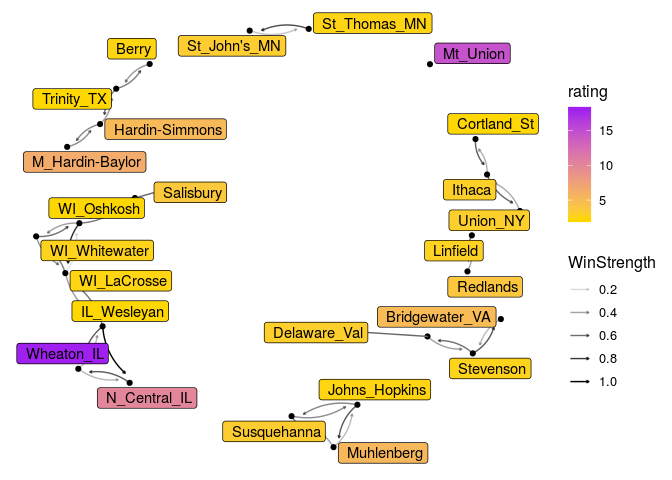

# R Notebook


```r
n<-network.initialize(nrow(rankedteams), directed = TRUE, multiple = FALSE, loops = TRUE)
rankedteams <- rankedteams %>% mutate(ranking = min_rank(desc(Rating)))
network.vertex.names(n) <- as.character(teams$Team)
n %v% "rank" <- left_join(teams, rankedteams, c("Team"))$ranking
n %v% "rating" <- left_join(teams, rankedteams, c("Team"))$Rating
#n %v% "conference" <- as.character(rankedteams$Conference)

network.adjacency( A_unnormed, n, ignore.eval = FALSE, names.eval = c("WinStrength"))
```

#D1 Top 25 


```r
rankedteams %>% filter(Ranking < 26) %>% select(-ranking) %>%knitr::kable()
```


 Ranking     Rating  Team          
--------  ---------  --------------
       1   7.787725  Clemson       
       2   7.721841  Georgia       
       3   7.388705  Notre_Dame    
       4   6.845145  Alabama       
       5   6.732860  Ohio_St       
       6   5.816741  Washington    
       7   5.382264  Penn_St       
       8   5.234400  TCU           
       9   5.228801  Oklahoma      
      10   5.089111  Auburn        
      11   4.670114  UCF           
      12   4.142190  Oklahoma_St   
      13   4.028163  Washington_St 
      14   4.008050  Virginia_Tech 
      15   3.541847  USC           
      16   3.385663  Iowa          
      17   3.382719  Wake_Forest   
      18   3.078747  Wisconsin     
      19   3.040563  Iowa_St       
      20   2.978466  Texas_Tech    
      21   2.970307  Miami_FL      
      22   2.794285  NC_State      
      23   2.764864  West_Virginia 
      24   2.745034  Michigan_St   
      25   2.699893  Michigan      


```r
filter(rankedteams, Team %in% FBSteams$X2) %>% filter( min_rank( desc(Rating)) <26) %>% select(-ranking) %>% knitr::kable()
```


 Ranking     Rating  Team          
--------  ---------  --------------
       1   7.787725  Clemson       
       2   7.721841  Georgia       
       3   7.388705  Notre_Dame    
       4   6.845145  Alabama       
       5   6.732860  Ohio_St       
       6   5.816741  Washington    
       7   5.382264  Penn_St       
       8   5.234400  TCU           
       9   5.228801  Oklahoma      
      10   5.089111  Auburn        
      11   4.670114  UCF           
      12   4.142190  Oklahoma_St   
      13   4.028163  Washington_St 
      14   4.008050  Virginia_Tech 
      15   3.541847  USC           
      16   3.385663  Iowa          
      17   3.382719  Wake_Forest   
      18   3.078747  Wisconsin     
      19   3.040563  Iowa_St       
      20   2.978466  Texas_Tech    
      21   2.970307  Miami_FL      
      22   2.794285  NC_State      
      23   2.764864  West_Virginia 
      24   2.745034  Michigan_St   
      25   2.699893  Michigan      


```r
#net<-ggnetwork(n %s% which( n %v% "rank" < 26), layout="fruchtermanreingold")
net<-ggnetwork(n , layout="fruchtermanreingold")
ggplot(net, aes(x = x, y = y, xend = xend, yend = yend))+
  geom_edges(alpha=0.1)+
  geom_nodes( aes(color=rating), alpha=0.5 ) +theme_blank()+
  scale_color_gradient(low="purple", high="gold")#+
```

<!-- -->

```r
#  geom_nodelabel_repel(aes(label=vertex.names))
```


```r
net<-ggnetwork(n %s% which( n %v% "rank" < 26), layout="fruchtermanreingold")
#net<-ggnetwork(n , layout="fruchtermanreingold")
ggplot(net, aes(x = x, y = y, xend = xend, yend = yend))+
  geom_edges(aes(alpha=WinStrength), curvature = 0.2)+
  geom_nodes(  ) +theme_blank()+
  geom_nodelabel_repel(aes(label=vertex.names, fill=rank))+
  scale_color_gradient(low="purple", high="gold")+
  scale_fill_gradient(low="gold", high="purple")
```

```
## Warning: Ignoring unknown parameters: segment.color
```

<!-- -->


```r
n<-network.initialize(nrow(rankedteams), directed = TRUE, multiple = FALSE, loops = TRUE)
rankedteams <- rankedteams %>% mutate(ranking = min_rank(desc(Rating)))
network.vertex.names(n) <- as.character(teams$Team)
n %v% "rank" <- left_join(teams, rankedteams, c("Team"))$ranking
n %v% "rating" <- left_join(teams, rankedteams, c("Team"))$Rating
#n %v% "conference" <- as.character(rankedteams$Conference)

network.adjacency( A_unnormed, n, ignore.eval = FALSE, names.eval = c("WinStrength"))
```

#D3 Top 25 


```r
rankedteams %>% filter(Ranking < 26) %>% select(-ranking) %>%knitr::kable()
```


 Ranking      Rating  Team            
--------  ----------  ----------------
       1   37.286483  Mt_Union        
       2    9.627719  M_Hardin-Baylor 
       3    6.054454  Hardin-Simmons  
       4    4.982219  Brockport_St    
       5    4.308728  Springfield     
       6    4.035172  Delaware_Val    
       7    3.456132  Hobart_&_Smith  
       8    3.341611  Trine           
       9    3.287098  Ohio_Northern   
      10    3.169714  N_Central_IL    
      11    2.998760  Wesley_DE       
      12    2.801241  Linfield        
      13    2.616020  Framingham_St   
      14    2.614519  George_Fox      
      15    2.553386  Wheaton_IL      
      16    2.422092  Wittenberg      
      17    2.415941  Frostburg_St    
      18    2.411277  St_Thomas_MN    
      19    2.370034  WI_Platteville  
      20    2.301882  IL_Wesleyan     
      21    2.244943  Trinity_CT      
      22    2.083732  Johns_Hopkins   
      23    2.004263  Wash_&_Jeff     
      24    2.003549  Heidelberg      
      25    1.965188  Chris_Newport   

```r
rankedteams %>% filter(Team == " Loras") %>% select(-ranking)
```

```
##   Ranking    Rating   Team
## 1      85 0.9304836  Loras
```


```r
#net<-ggnetwork(n %s% which( n %v% "rank" < 26), layout="fruchtermanreingold")
net<-ggnetwork(n , layout="fruchtermanreingold")
ggplot(net, aes(x = x, y = y, xend = xend, yend = yend))+
  geom_edges(alpha=0.1)+
  geom_nodes( aes(color=rating), alpha=0.5 ) +theme_blank()+
  scale_color_gradient(low="purple", high="gold")#+
```

<!-- -->

```r
#  geom_nodelabel_repel(aes(label=vertex.names))
```


```r
net<-ggnetwork(n %s% which( n %v% "rank" < 26), layout="fruchtermanreingold")
#net<-ggnetwork(n , layout="fruchtermanreingold")
ggplot(net, aes(x = x, y = y, xend = xend, yend = yend))+
  geom_edges(aes(alpha=WinStrength), curvature = 0.2)+
  geom_nodes(  ) +theme_blank()+
  geom_nodelabel_repel(aes(label=vertex.names, fill=rank))+
  scale_color_gradient(low="purple", high="gold")+
  scale_fill_gradient(low="gold", high="purple")
```

```
## Warning: Ignoring unknown parameters: segment.color
```

<!-- -->
