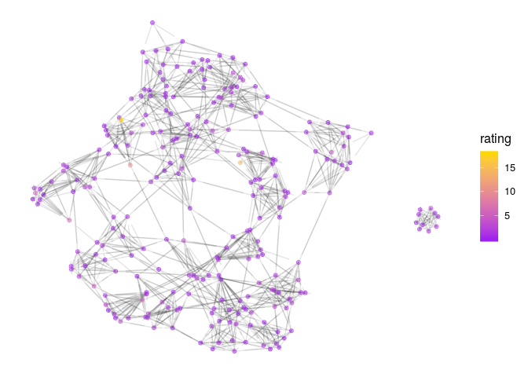

```r
n<-network.initialize(nrow(rankedteams), directed = TRUE, multiple = FALSE, loops = TRUE)
rankedteams <- rankedteams %>% mutate(ranking = min_rank(desc(Rating)))
network.vertex.names(n) <- as.character(teams$Team)
n %v% "rank" <- left_join(teams, rankedteams, c("Team"))$ranking
n %v% "rating" <- left_join(teams, rankedteams, c("Team"))$Rating
#n %v% "conference" <- as.character(rankedteams$Conference)

network.adjacency( A_unnormed, n, ignore.eval = FALSE, names.eval = c("WinStrength"))
```

#D1 Top 25 


```r
rankedteams %>% filter(Ranking < 26) %>% select(-ranking) %>%knitr::kable()
```


 Ranking     Rating  Team           
--------  ---------  ---------------
       1   6.200294  Clemson        
       2   5.943754  Oklahoma       
       3   5.805010  Auburn         
       4   5.687252  Penn_St        
       5   5.563977  Ohio_St        
       6   5.372236  Alabama        
       7   5.221914  Notre_Dame     
       8   5.053769  Miami_FL       
       9   4.817817  Wisconsin      
      10   4.736633  Georgia        
      11   4.730717  Oklahoma_St    
      12   4.647696  TCU            
      13   4.091436  Iowa_St        
      14   3.847587  UCF            
      15   3.789681  Virginia_Tech  
      16   3.744390  Iowa           
      17   3.633707  Washington     
      18   3.143615  Georgia_Tech   
      19   3.121306  Texas          
      20   3.058587  Wake_Forest    
      21   2.993038  West_Virginia  
      22   2.966668  NC_State       
      23   2.801138  USC            
      24   2.594257  Mississippi_St 
      25   2.529745  Michigan       


```r
filter(rankedteams, Team %in% FBSteams$X2) %>% filter( min_rank( desc(Rating)) <26) %>% select(-ranking) %>% knitr::kable()
```


 Ranking     Rating  Team           
--------  ---------  ---------------
       1   6.200294  Clemson        
       2   5.943754  Oklahoma       
       3   5.805010  Auburn         
       4   5.687252  Penn_St        
       5   5.563977  Ohio_St        
       6   5.372236  Alabama        
       7   5.221914  Notre_Dame     
       8   5.053769  Miami_FL       
       9   4.817817  Wisconsin      
      10   4.736633  Georgia        
      11   4.730717  Oklahoma_St    
      12   4.647696  TCU            
      13   4.091436  Iowa_St        
      14   3.847587  UCF            
      15   3.789681  Virginia_Tech  
      16   3.744390  Iowa           
      17   3.633707  Washington     
      18   3.143615  Georgia_Tech   
      19   3.121306  Texas          
      20   3.058587  Wake_Forest    
      21   2.993038  West_Virginia  
      22   2.966668  NC_State       
      23   2.801138  USC            
      24   2.594257  Mississippi_St 
      25   2.529745  Michigan       


```r
#net<-ggnetwork(n %s% which( n %v% "rank" < 26), layout="fruchtermanreingold")
net<-ggnetwork(n , layout="fruchtermanreingold")
ggplot(net, aes(x = x, y = y, xend = xend, yend = yend))+
  geom_edges(alpha=0.1)+
  geom_nodes( aes(color=rating), alpha=0.5 ) +theme_blank()+
  scale_color_gradient(low="purple", high="gold")#+
```

<!-- -->

```r
#  geom_nodelabel_repel(aes(label=vertex.names))
```


```r
net<-ggnetwork(n %s% which( (n %v% "vertex.names") %in% FBSteams$X2), layout="fruchtermanreingold")
#net<-ggnetwork(n , layout="fruchtermanreingold")
ggplot(net, aes(x = x, y = y, xend = xend, yend = yend))+
  geom_edges(alpha=0.1)+
  geom_nodes( aes(color=rating), alpha=0.5 ) +theme_blank()+
  scale_color_gradient(low="purple", high="gold")#+
```

<!-- -->

```r
#  geom_nodelabel_repel(aes(label=vertex.names))
```


```r
net<-ggnetwork(n %s% which( n %v% "rank" < 26), layout="fruchtermanreingold")
#net<-ggnetwork(n , layout="fruchtermanreingold")
ggplot(net, aes(x = x, y = y, xend = xend, yend = yend))+
  geom_edges(aes(alpha=WinStrength), curvature = 0.2)+
  geom_nodes(  ) +theme_blank()+
  geom_nodelabel_repel(aes(label=vertex.names, fill=rank))+
  scale_color_gradient(low="purple", high="gold")+
  scale_fill_gradient(low="gold", high="purple")
```

```
## Warning: Ignoring unknown parameters: segment.color
```

<!-- -->


```r
n<-network.initialize(nrow(rankedteams), directed = TRUE, multiple = FALSE, loops = TRUE)
rankedteams <- rankedteams %>% mutate(ranking = min_rank(desc(Rating)))
network.vertex.names(n) <- as.character(teams$Team)
n %v% "rank" <- left_join(teams, rankedteams, c("Team"))$ranking
n %v% "rating" <- left_join(teams, rankedteams, c("Team"))$Rating
#n %v% "conference" <- as.character(rankedteams$Conference)

network.adjacency( A_unnormed, n, ignore.eval = FALSE, names.eval = c("WinStrength"))
```

#D3 Top 25 


```r
rankedteams %>% filter(Ranking < 26) %>% select(-ranking) %>%knitr::kable()
```


 Ranking      Rating  Team            
--------  ----------  ----------------
       1   13.513084  Mt_Union        
       2    6.129720  M_Hardin-Baylor 
       3    5.990785  Springfield     
       4    5.426116  Brockport_St    
       5    5.185395  Wheaton_IL      
       6    4.605977  Delaware_Val    
       7    4.151571  N_Central_IL    
       8    3.584147  Wesley_DE       
       9    3.572488  WI_Oshkosh      
      10    3.568787  Hardin-Simmons  
      11    3.358609  John_Carroll    
      12    3.197734  St_Thomas_MN    
      13    3.162172  Johns_Hopkins   
      14    2.997010  Trine           
      15    2.994655  IL_Wesleyan     
      16    2.990995  Hobart_&_Smith  
      17    2.824472  Frostburg_St    
      18    2.796012  Case_Western    
      19    2.793777  Linfield        
      20    2.681787  Wartburg        
      21    2.666858  WI_LaCrosse     
      22    2.464766  Wittenberg      
      23    2.446278  Trinity_CT      
      24    2.351605  WI_Whitewater   
      25    2.221931  Husson          

```r
rankedteams %>% filter(Team == " Loras") %>% select(-ranking)
```

```
##   Ranking    Rating   Team
## 1     140 0.5362939  Loras
```


```r
#net<-ggnetwork(n %s% which( n %v% "rank" < 26), layout="fruchtermanreingold")
net<-ggnetwork(n , layout="fruchtermanreingold")
ggplot(net, aes(x = x, y = y, xend = xend, yend = yend))+
  geom_edges(alpha=0.1)+
  geom_nodes( aes(color=rating), alpha=0.5 ) +theme_blank()+
  scale_color_gradient(low="purple", high="gold")#+
```

<!-- -->

```r
#  geom_nodelabel_repel(aes(label=vertex.names))
```


```r
net<-ggnetwork(n %s% which( n %v% "rank" < 26), layout="fruchtermanreingold")
#net<-ggnetwork(n , layout="fruchtermanreingold")
ggplot(net, aes(x = x, y = y, xend = xend, yend = yend))+
  geom_edges(aes(alpha=WinStrength), curvature = 0.2)+
  geom_nodes(  ) +theme_blank()+
  geom_nodelabel_repel(aes(label=vertex.names, fill=rank))+
  scale_color_gradient(low="purple", high="gold")+
  scale_fill_gradient(low="gold", high="purple")
```

```
## Warning: Ignoring unknown parameters: segment.color
```

<!-- -->
